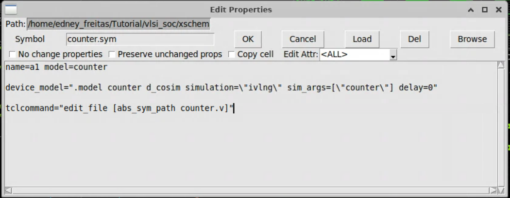
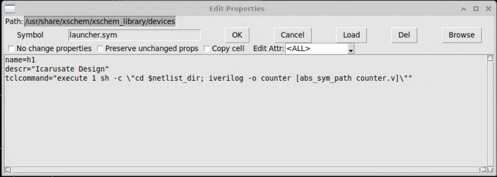
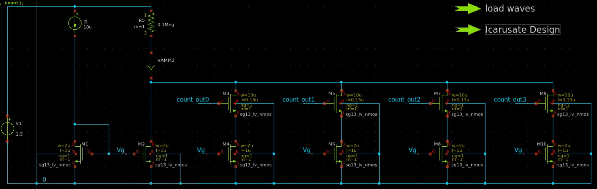
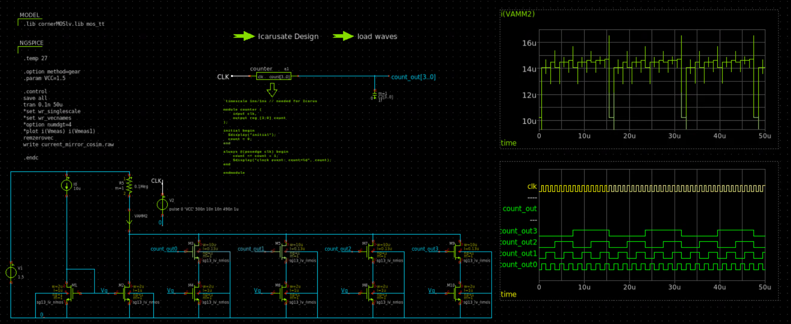
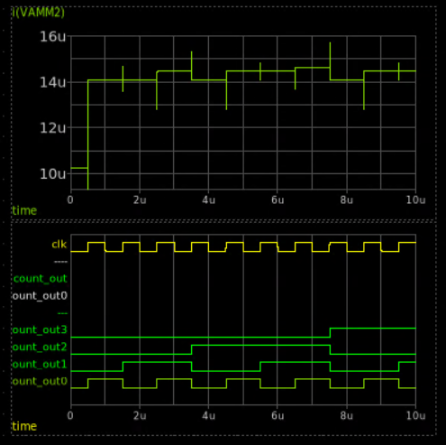

# Full tutorial: Verilog counter + analog testbench in Xschem (Ngspice + Icarus + d_cosim)

This document assumes you start from zero: no prior files, no prior schematic.

You will learn:

1. What a counter is and how to write one in Verilog
2. How Xschem organizes symbols and libraries
3. How to represent a Verilog block as a symbol in Xschem
4. How Ngspice + `d_cosim` can co-simulate analog and digital
5. How to build an analog testbench (current mirror + switches) to “observe” the counter outputs

---

## 1. Concepts

### 1.1 What is a (binary) counter?

A **binary counter** is a sequential digital circuit that increments its output value on each clock event.

- A **4-bit** counter has 16 states: 0 to 15.
- On each **rising edge** of the clock (`posedge clk`), it adds 1.
- After 15 it wraps back to 0 (overflow).

Outputs are bits:
- `count[0]` toggles every clock.
- `count[1]` toggles every 2 clocks.
- `count[2]` toggles every 4 clocks.
- `count[3]` toggles every 8 clocks.

### 1.2 What is AMS co-simulation here?

We want the digital counter (Verilog) and an analog circuit (SPICE) to run together:

- Digital: Icarus Verilog provides the logic and state updates.
- Analog: Ngspice solves voltages/currents.
- Bridge: `d_cosim` maps analog voltages on nodes into digital logic levels (0/1) and maps digital outputs back as analog drivers.

This is useful when:
- you have a digital control block and an analog front-end
- you want to validate interfaces, edge cases, delays, loading, and mixed-signal behavior

---

## 2. Toolchain overview

### 2.1 Xschem

Xschem is the schematic editor. It:
- places symbols (`.sym`)
- saves schematics (`.sch`)
- generates simulation netlists (SPICE)
- can show waveforms by reading `.raw` data

### 2.2 Ngspice (with XSPICE)

Ngspice runs the analog simulation. With XSPICE enabled, it also supports **code models**, including `d_cosim`.

Without XSPICE, `d_cosim` will not work.

### 2.3 Icarus Verilog

Icarus compiles Verilog into a simulation executable:

- `iverilog -o counter counter.v` produces a `counter` file
- `vvp counter` executes it

In this flow, Ngspice triggers the digital events through `d_cosim`, so the Verilog block does not need a separate Verilog testbench.

---

## 3. Step-by-step: create the Verilog counter

Create `xschem/counter.v`:

```verilog
`timescale 1ns/1ns  // recommended when using Icarus

module counter (
    input  clk,
    output reg [3:0] count
);

initial begin
    $display("initial");
    count = 0;
end

always @(posedge clk) begin
    count <= count + 1;
    $display("clock event: count=%0d", count);
end

endmodule
```

Key points:
- `reg [3:0] count` because it is assigned in an `always` block.
- Non-blocking assignment (`<=`) is idiomatic for sequential logic.
- `timescale` helps avoid time-unit ambiguity when tools interact.

---

## 4. Step-by-step: configure Xschem libraries

If Xschem cannot find symbols, you will see boxes saying `MISSING SYMBOL`.

Xschem searches symbols using the Tcl variable `XSCHEM_LIBRARY_PATH` (a colon-separated list of directories).

Run:

```bash
./scripts/setup_xschem_paths.sh
```

Then restart Xschem.

### 4.1 How to verify inside Xschem

Open **Options -> Tcl console** and run:

```tcl
puts $XSCHEM_LIBRARY_PATH
```

This prints the search path Xschem is actually using (more reliable than `echo $XSCHEM_LIBRARY_PATH` in your shell).

---

## 5. Step-by-step: create a symbol for the Verilog block

There are two parts:

1) the **symbol drawing** (`counter.sym`) with pins
2) the **instance properties** (in the schematic) telling Ngspice to use `d_cosim`

### 5.1 Create the symbol file (`counter.sym`)

In Xschem:

1. **File -> New** (choose symbol)
2. Draw a rectangle (this is the graphic body)
3. Add pins:
   - `clk` (input)
   - `count[3..0]` (output bus)

Pin conventions:
- Use `count[3..0]` (Xschem bus syntax) for a 4-bit vector.
- Set pin directions appropriately (in/out).

Save the symbol as:

```text
xschem/counter.sym
```

Tip: this repo already includes a working `counter.sym` you can reuse.

### 5.2 Optional: show the Verilog source inside Xschem

You can place `devices/code_shown.sym` and set its `value` to:

```tcl
tcleval([read_data [abs_sym_path counter.v]])
```

This makes the Verilog file appear as readable text on the schematic, which is useful for tutorials and reviews.

### 5.3 Add the d_cosim model (instance properties)

Place `counter.sym` into your schematic. Then select it and press `q` (Edit Properties).

Set:

```text
name=a1
model=counter
device_model=".model counter d_cosim simulation=\"ivlng\" sim_args=[\"counter\"] delay=0"
tclcommand="edit_file [abs_sym_path counter.v]"
```

Notes:
- `device_model=...` injects a SPICE `.model` statement for `d_cosim`.
- `simulation="ivlng"` selects the Icarus Verilog interface.
- `sim_args=["counter"]` tells `d_cosim` which compiled Icarus executable to run.
- `delay=0` removes extra transport delay between analog and digital.
- `tclcommand=...` makes it easy to open the Verilog file. In many Xschem setups, you trigger this with **Ctrl + click** on the symbol (not double click).

Example screenshot:



---

## 6. Step-by-step: compile the Verilog for co-simulation

`d_cosim` does not compile Verilog for you. You must create the `counter` executable first.

From the repository root:

```bash
cd xschem
iverilog -o counter counter.v
```

This creates `xschem/counter`, which Ngspice will execute via `vvp` during co-simulation.

Inside the demo schematic, this compilation step is wrapped in a `launcher.sym` button labeled **Icarusate Design**.

Launcher property:

```tcl
tclcommand="execute 1 sh -c \"cd $netlist_dir; iverilog -o counter [abs_sym_path counter.v]\""
```

Example screenshot:



---

## 7. Step-by-step: build the analog testbench (current mirror + switched sinks)

The goal: turn digital bits into an analog observable quantity.

### 7.1 Circuit idea

We create:

1. A **reference current source** `I0 = 10uA`
2. A **diode-connected NMOS** `M1` to generate a gate bias `Vg`
3. A **current mirror** (`M2` mirrors `M1`) that produces a unit sink current
4. Four **switched copies** of a unit current sink (`M4, M6, M8, M10`) controlled by the counter outputs through **switch transistors** (`M3, M5, M7, M9`)
5. A **sense resistor** `R5` that converts total sink current into a measurable voltage
6. A **0 V source** `VAMM2` used as an ammeter so we can plot `i(VAMM2)`

When a counter bit is high, its switch turns on, enabling an extra current sink. The total current changes over time, producing the staircase-like analog waveform.

Schematic snapshot:




Final co-simulation schematic (digital counter + analog current mirror + plots in one view):



### 7.2 Netlist (core part)

The included netlist is in `xschem/simulation/current_mirror_cosim.spice`.

Key elements (simplified):

```spice
* Supply
V1 net1 0 1.5

* Reference current to bias the mirror
I0 net1 Vg 10u

* Diode-connected NMOS sets Vg
M1 Vg Vg 0 0 sg13_lv_nmos w=2u l=1u

* Mirror device produces a base sink current
M2 net3 Vg 0 0 sg13_lv_nmos w=2u l=1u

* Sense resistor and ammeter
R5 net1 net2 0.1Meg
VAMM2 net2 net3 0

* Bit-controlled current sinks
M3 net3 count_out0 net4 0 sg13_lv_nmos w=10u l=0.13u  ; switch
M4 net4 Vg 0 0       sg13_lv_nmos w=2u  l=1u         ; sink
...
```

### 7.3 Why two NMOS per bit?

- The **sink transistor** (e.g., `M4`) is biased by `Vg`, so it behaves as a current source/sink.
- The **switch transistor** (e.g., `M3`) is controlled by a digital node and acts like an on/off gate.
- This isolates the analog bias network (`Vg`) from the digital outputs.

### 7.4 What you should plot

- `i(VAMM2)` : total sink current
- `clk` and `count_out[0..3]` : digital behavior (as analog waveforms)

Example plot:



---

## 8. Step-by-step: run the full AMS simulation

### Option A: run from inside Xschem (recommended)

1. Open the schematic:

```bash
xschem xschem/current_mirror_cosim.sch
```

2. **Ctrl + click** `Icarusate Design` to compile the Verilog block.
3. Run simulation (**Simulation -> Run**).
4. **Ctrl + click** `load waves` to load and plot the `.raw` results.

### Option B: run Ngspice from the terminal

```bash
cd xschem/simulation
ngspice -b -o run.log current_mirror_cosim.spice
```

This produces:
- `run.log`
- `current_mirror_cosim.raw`

You can open plots in Xschem by using `raw_read` (the `load waves` launcher does this automatically).

---

## 9. Understanding the launchers

The schematic uses the standard Xschem symbol `devices/launcher.sym` as a clickable button that executes a Tcl command.

Two launchers are included:

1) **Icarusate Design**: compile Verilog with Icarus  
2) **load waves**: read `.raw` simulation output into Xschem plots

Both are triggered by **Ctrl + click** in many setups.

If Ctrl + click does nothing, check:
- Xschem key bindings
- whether the symbol really has a `tclcommand=` property
- the Xschem console output (errors are printed there)

---

## 10. Next steps

Once you understand this example, try:

- Replace `counter.v` with your own digital module (FSM, PWM, serializer)
- Add more realistic analog loads on the digital outputs (capacitance, RC, level shifting)
- Add a reset input and verify power-on behavior
- Measure propagation delays from analog edges into digital events (or vice-versa)

For common issues, see [`docs/TROUBLESHOOTING.md`](./TROUBLESHOOTING.md).
